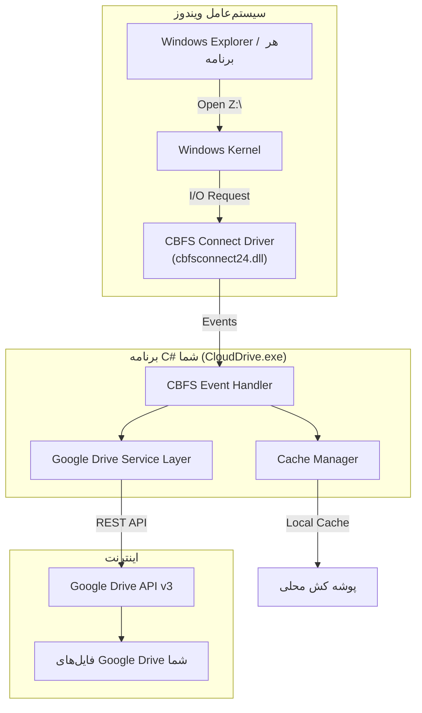

# سند توسعه: پروژه CloudDrive
## ماونت کردن Google Drive به عنوان درایو Z: در ویندوز با استفاده از CBFS Connect 2024

---

## ۱. خلاصه پروژه

| پارامتر | مقدار |
|---|---|
| **نام پروژه** | CloudDrive |
| **هدف** | نمایش فضای Google Drive شخصی به عنوان یک درایو محلی (`Z:`) در ویندوز |
| **تکنولوژی اصلی** | CBFS Connect 2024 .NET Edition (v24.0.9258) |
| **زبان برنامه‌نویسی** | C# (.NET 8 یا .NET 6) |
| **سیستم‌عامل هدف (فاز ۱)** | Windows 10/11 (x64) |
| **سیستم‌عامل هدف (فاز ۲)** | Linux (از طریق FUSE) |
| **IDE پیشنهادی** | Visual Studio 2022 Community (رایگان) یا JetBrains Rider |

---

## ۲. معماری کلی سیستم



> [!IMPORTANT]
> **جریان کار:** کاربر درایو `Z:` را در ویندوز باز می‌کند → ویندوز درخواست را به درایور CBFS می‌دهد → درایور CBFS رویدادی (Event) در برنامه C# شما صدا می‌زند → برنامه C# شما از طریق API گوگل فایل‌ها را واکشی می‌کند و به ویندوز برمی‌گرداند.

---

## ۳. پیش‌نیازها و ابزارها

### ۳.۱ ابزارهای توسعه

| ابزار | نسخه | توضیح |
|---|---|---|
| **Visual Studio 2022** | Community (رایگان) | محیط توسعه اصلی |
| **.NET SDK** | 8.0+ یا 6.0+ | فریم‌ورک اجرایی |
| **Git** | آخرین نسخه | مدیریت سورس‌کد |

### ۳.۲ پکیج‌های NuGet مورد نیاز

| پکیج | نسخه | کاربرد |
|---|---|---|
| `callback.CBFSConnect` | 24.0.9258 | هسته اصلی ساخت درایو مجازی (آفلاین از فایل `.nupkg` موجود) |
| `Google.Apis.Drive.v3` | آخرین | ارتباط با API گوگل درایو |
| `Google.Apis.Auth` | آخرین | احراز هویت OAuth 2.0 |
| `Newtonsoft.Json` | آخرین | پردازش JSON |
| `Serilog` | آخرین | لاگ‌گذاری حرفه‌ای |

### ۳.۳ فایل‌های موجود ما

| فایل | مسیر |
|---|---|
| **NuGet Package** | `CBFS2024/CBFS Connect/callback.cbfsconnect.24.0.9258.nupkg` |
| **License Key** | `43434E4A414230303333393434374D304E544152415A00...` (در فایل لایسنس) |

### ۳.۴ تنظیمات Google Cloud Console

> [!WARNING]
> قبل از شروع کدنویسی، باید یک پروژه در Google Cloud Console بسازید و Google Drive API را فعال کنید. بدون این مرحله هیچ ارتباطی با گوگل درایو امکان‌پذیر نیست.

مراحل:
1. به [Google Cloud Console](https://console.cloud.google.com) بروید
2. یک پروژه جدید بسازید (مثلاً `CloudDrive`)
3. در بخش **APIs & Services** سرویس **Google Drive API** را فعال (Enable) کنید
4. در بخش **Credentials** یک **OAuth 2.0 Client ID** از نوع **Desktop Application** بسازید
5. فایل `credentials.json` را دانلود و در پوشه پروژه قرار دهید

---

## ۴. ساختار پروژه (Solution Architecture)

```
CloudDrive/
├── CloudDrive.sln                          # فایل Solution
├── src/
│   ├── CloudDrive.Core/                    # هسته اصلی
│   │   ├── VirtualDriveManager.cs          # مدیریت CBFS و ساخت/حذف درایو
│   │   ├── EventHandlers/
│   │   │   ├── FileEventHandler.cs         # هندلر رویدادهای فایل (Read/Write/Create/Delete)
│   │   │   ├── DirectoryEventHandler.cs    # هندلر رویدادهای پوشه (Enumerate/Create)
│   │   │   └── MetadataEventHandler.cs     # هندلر رویدادهای متادیتا (GetFileInfo/SetAttributes)
│   │   ├── CloudProviders/
│   │   │   ├── ICloudProvider.cs           # اینترفیس عمومی (برای پشتیبانی چند کلود)
│   │   │   ├── GoogleDriveProvider.cs      # پیاده‌سازی اختصاصی گوگل درایو
│   │   │   └── OneDriveProvider.cs         # (فاز آینده) پیاده‌سازی OneDrive
│   │   ├── Cache/
│   │   │   ├── FileCacheManager.cs         # مدیریت کش فایل‌ها روی دیسک محلی
│   │   │   └── MetadataCacheManager.cs     # کش متادیتای فایل‌ها (اندازه، تاریخ، نوع)
│   │   ├── Auth/
│   │   │   └── GoogleAuthManager.cs        # مدیریت احراز هویت OAuth 2.0
│   │   └── Models/
│   │       ├── CloudFileItem.cs            # مدل اطلاعات فایل/پوشه
│   │       └── DriveConfig.cs              # مدل تنظیمات درایو
│   │
│   ├── CloudDrive.App/                     # اپلیکیشن اصلی
│   │   ├── Program.cs                      # نقطه ورود برنامه
│   │   ├── appsettings.json                # تنظیمات (حرف درایو، مسیر کش، ...)
│   │   └── credentials.json                # کلید OAuth گوگل (دانلود از Google Console)
│   │
│   └── CloudDrive.Tray/                    # (فاز آینده) آیکون System Tray
│       ├── TrayApp.cs
│       └── TrayMenu.cs
│
├── tests/
│   └── CloudDrive.Tests/                   # تست‌های واحد
│       ├── GoogleDriveProviderTests.cs
│       └── CacheManagerTests.cs
│
├── drivers/                                # درایورهای CBFS (از nupkg استخراج می‌شود)
│   └── cbfs.cab
│
└── README.md
```

---

## ۵. رویدادهای CBFS Connect (قلب پروژه)

CBFS Connect یک معماری Event-Driven دارد. وقتی ویندوز درخواستی روی درایو `Z:` انجام می‌دهد، رویدادی در برنامه C# شما صدا زده می‌شود. شما باید این رویدادها را پیاده‌سازی کنید:

### ۵.۱ رویدادهای ضروری (Must Implement)

| رویداد | زمان صدا زدن | کار شما |
|---|---|---|
| `OnMount` | هنگام ماونت شدن درایو | اتصال اولیه به Google Drive و بارگذاری لیست فایل‌ها |
| `OnUnmount` | هنگام جدا شدن درایو | پاکسازی منابع و بستن اتصال‌ها |
| `OnGetVolumeSize` | ویندوز حجم درایو را می‌خواهد | برگرداندن فضای کل و آزاد Google Drive |
| `OnGetVolumeLabel` | ویندوز نام درایو را می‌خواهد | برگرداندن نام مثل `"Google Drive"` |
| `OnGetFileInfo` | ویندوز اطلاعات یک فایل/پوشه را می‌خواهد | بازگشت اندازه، تاریخ، و نوع (فایل/پوشه) |
| `OnEnumerateDirectory` | کاربر یک پوشه را باز می‌کند | لیست فایل‌ها و پوشه‌ها از Google Drive API |
| `OnOpenFile` | کاربر فایلی را باز می‌کند | آماده‌سازی فایل برای خواندن/نوشتن |
| `OnCloseFile` | کاربر فایل را می‌بندد | پاکسازی منابع و فلاش کش |
| `OnReadFile` | کاربر فایلی را می‌خواند/کپی می‌کند | دانلود محتوای فایل از Google Drive |
| `OnWriteFile` | کاربر فایلی را در درایو ذخیره می‌کند | آپلود محتوای فایل به Google Drive |

### ۵.۲ رویدادهای مهم (Should Implement)

| رویداد | زمان صدا زدن | کار شما |
|---|---|---|
| `OnCreateFile` | کاربر فایل/پوشه جدید می‌سازد | ساخت فایل/پوشه در Google Drive |
| `OnDeleteFile` | کاربر فایل/پوشه‌ای را حذف می‌کند | حذف از Google Drive (یا انتقال به Trash) |
| `OnRenameOrMoveFile` | کاربر فایل را Rename یا Move می‌کند | تغییر نام یا جابجایی در Google Drive |
| `OnSetFileAttributes` | تغییر Attributes فایل (مثل Read-Only) | به‌روزرسانی متادیتا |
| `OnFlushFile` | ویندوز درخواست Flush می‌دهد | اطمینان از نوشته شدن تمام داده‌ها |
| `OnCanFileBeDeleted` | آیا فایل قابل حذف است؟ | بررسی مجوزها |

### ۵.۳ رویدادهای پیشرفته (Nice to Have)

| رویداد | توضیح |
|---|---|
| `OnGetFileSecurity` | مدیریت ACL و مجوزهای NTFS |
| `OnSetFileSecurity` | تنظیم مجوزهای امنیتی |
| `OnQueryEa` | Extended Attributes |
| `OnSetEa` | تنظیم Extended Attributes |

---

## ۶. فازبندی پروژه و تسک‌ها

---

### فاز ۱: راه‌اندازی اولیه و نمایش درایو خالی (هفته ۱)

> **هدف:** درایو `Z:` در ویندوز ظاهر شود (حتی اگر خالی باشد)

| # | تسک | جزئیات | وابستگی |
|---|---|---|---|
| 1.1 | نصب Visual Studio 2022 Community | دانلود و نصب به همراه Workload "ASP.NET and web development" و ".NET Desktop Development" | - |
| 1.2 | نصب .NET 8 SDK | اگر همراه VS نصب نشده، جداگانه نصب شود | 1.1 |
| 1.3 | ساخت Solution و پروژه‌ها | ایجاد `CloudDrive.sln` با ۳ پروژه: `Core`، `App`، `Tests` | 1.1 |
| 1.4 | افزودن NuGet آفلاین | پکیج `callback.cbfsconnect.24.0.9258.nupkg` را به عنوان Local Source اضافه کنید | 1.3 |
| 1.5 | نوشتن کلاس `VirtualDriveManager` | مقداردهی اولیه شیء `CBFS`، تنظیم لایسنس، و ثبت رویدادها | 1.4 |
| 1.6 | نصب درایور CBFS | استفاده از `CBFSInst.dll` برای نصب درایور در ویندوز (نیاز به Admin) | 1.4 |
| 1.7 | پیاده‌سازی رویدادهای حداقلی | پیاده‌سازی `OnGetVolumeSize`, `OnGetVolumeLabel`, `OnGetFileInfo`, `OnEnumerateDirectory` با داده‌های ثابت (Hardcoded) | 1.5 |
| 1.8 | ماونت درایو `Z:` | فراخوانی `CreateStorage` و `MountMedia` و مشاهده درایو در My Computer | 1.6, 1.7 |
| 1.9 | تست دستی | باز کردن درایو Z در File Explorer و مشاهده فایل‌های تستی | 1.8 |

> [!TIP]
> **خروجی فاز ۱:** درایو `Z:` با نام "Google Drive" در My Computer نمایش داده می‌شود و فایل‌های تستی (Hardcoded) را نشان می‌دهد.

---

### فاز ۲: اتصال به Google Drive (هفته ۲)

> **هدف:** لیست واقعی فایل‌های Google Drive در درایو Z نمایش داده شود

| # | تسک | جزئیات | وابستگی |
|---|---|---|---|
| 2.1 | ساخت پروژه Google Cloud | ایجاد پروژه و فعال‌سازی Google Drive API در Console | - |
| 2.2 | ساخت OAuth Credentials | دریافت `credentials.json` از نوع Desktop Application | 2.1 |
| 2.3 | نوشتن `GoogleAuthManager` | پیاده‌سازی جریان OAuth 2.0 با باز شدن مرورگر برای لاگین | 2.2 |
| 2.4 | نوشتن اینترفیس `ICloudProvider` | تعریف متدهای عمومی: `ListFiles`, `DownloadFile`, `UploadFile`, `DeleteFile`, `CreateFolder`, `RenameFile`, `GetFileInfo`, `GetStorageQuota` | فاز ۱ |
| 2.5 | نوشتن `GoogleDriveProvider` | پیاده‌سازی `ICloudProvider` با استفاده از `Google.Apis.Drive.v3` | 2.3, 2.4 |
| 2.6 | تست لیست فایل‌ها | تست واحد برای `ListFiles` و مشاهده فایل‌ها در کنسول | 2.5 |
| 2.7 | اتصال Provider به CBFS Events | رویداد `OnEnumerateDirectory` را به `GoogleDriveProvider.ListFiles` وصل کنید | 2.5, فاز ۱ |
| 2.8 | تست یکپارچه | مشاهده لیست واقعی فایل‌های Google Drive در درایو Z | 2.7 |

> [!TIP]
> **خروجی فاز ۲:** درایو Z لیست واقعی فایل‌ها و پوشه‌های گوگل درایو شخصی شما را نمایش می‌دهد.

---

### فاز ۳: خواندن و دانلود فایل‌ها (هفته ۳)

> **هدف:** کاربر بتواند فایل‌ها را از درایو Z باز کند یا کپی کند

| # | تسک | جزئیات | وابستگی |
|---|---|---|---|
| 3.1 | پیاده‌سازی `OnOpenFile` | آماده‌سازی فایل برای خواندن/نوشتن، ذخیره Context | فاز ۲ |
| 3.2 | پیاده‌سازی `OnReadFile` | دانلود محتوای فایل از گوگل و نوشتن در بافر | 3.1 |
| 3.3 | پیاده‌سازی `OnCloseFile` | آزادسازی منابع | 3.1 |
| 3.4 | نوشتن `FileCacheManager` | ذخیره فایل‌های دانلود شده در کش محلی (مثلاً `%AppData%\CloudDrive\cache\`) برای جلوگیری از دانلود مجدد | 3.2 |
| 3.5 | نوشتن `MetadataCacheManager` | کش کردن لیست فایل‌ها و متادیتا با TTL (مثلاً ۵ دقیقه) | فاز ۲ |
| 3.6 | تست خواندن فایل | کپی کردن فایل از درایو Z به دسکتاپ و باز کردن آن | 3.4 |
| 3.7 | تست عملکرد | اطمینان از اینکه فایل‌های بزرگ (بالای ۱۰۰ مگابایت) بدون هنگ دانلود می‌شوند | 3.6 |

> [!TIP]
> **خروجی فاز ۳:** کاربر می‌تواند از درایو Z فایل‌ها را باز کند، کپی کند و بخواند.

---

### فاز ۴: نوشتن، ساخت و حذف فایل (هفته ۴)

> **هدف:** کاربر بتواند فایل‌ها را در درایو Z آپلود، حذف و تغییر نام دهد

| # | تسک | جزئیات | وابستگی |
|---|---|---|---|
| 4.1 | پیاده‌سازی `OnCreateFile` | ساختن فایل/پوشه جدید در Google Drive | فاز ۳ |
| 4.2 | پیاده‌سازی `OnWriteFile` | آپلود محتوای فایل به Google Drive (پشتیبانی از Resumable Upload برای فایل‌های بزرگ) | 4.1 |
| 4.3 | پیاده‌سازی `OnDeleteFile` | حذف فایل/پوشه (انتقال به Trash گوگل) | فاز ۳ |
| 4.4 | پیاده‌سازی `OnRenameOrMoveFile` | تغییر نام و جابجایی فایل/پوشه | فاز ۳ |
| 4.5 | پیاده‌سازی `OnCanFileBeDeleted` | بررسی مجوز حذف | 4.3 |
| 4.6 | پیاده‌سازی `OnFlushFile` | اطمینان از نوشته شدن کامل داده‌ها | 4.2 |
| 4.7 | تست آپلود | درگ اند دراپ فایل به درایو Z و بررسی در google.com/drive | 4.2 |
| 4.8 | تست حذف و تغییر نام | حذف و Rename فایل از درایو Z | 4.3, 4.4 |

> [!TIP]
> **خروجی فاز ۴:** درایو Z کاملاً دوطرفه است. خواندن، نوشتن، حذف و تغییر نام همگی کار می‌کنند.

---

### فاز ۵: بهینه‌سازی و رابط کاربری (هفته ۵-۶)

> **هدف:** نرم‌افزار آماده استفاده روزمره شود

| # | تسک | جزئیات | وابستگی |
|---|---|---|---|
| 5.1 | اضافه کردن آیکون System Tray | آیکونی در نوار وظیفه ویندوز برای مدیریت درایو (Mount/Unmount/Settings) | فاز ۴ |
| 5.2 | پیاده‌سازی Auto-Start | اجرای خودکار برنامه با ویندوز و ماونت درایو | 5.1 |
| 5.3 | بهینه‌سازی کش | پیاده‌سازی LRU Cache با محدودیت حجم (مثلاً حداکثر ۱ گیگابایت کش) | فاز ۳ |
| 5.4 | مدیریت خطا و آفلاین | نمایش پیام مناسب وقتی اینترنت قطع است | فاز ۴ |
| 5.5 | لاگ‌گذاری | پیاده‌سازی Serilog برای ثبت تمام عملیات‌ها در فایل لاگ | فاز ۴ |
| 5.6 | Progress Bar برای آپلود/دانلود | نمایش وضعیت انتقال فایل‌ها | 5.1 |
| 5.7 | تنظیمات کاربر | انتخاب حرف درایو، اندازه کش، و مسیر کش از طریق UI | 5.1 |

---

### فاز ۶: پشتیبانی از سایر کلودها (آینده)

> **هدف:** علاوه بر گوگل، درایوهای ابری دیگر نیز قابل ماونت باشند

| # | تسک | جزئیات |
|---|---|---|
| 6.1 | پیاده‌سازی `OneDriveProvider` | پشتیبانی از Microsoft OneDrive با استفاده از Microsoft Graph API |
| 6.2 | پیاده‌سازی `DropboxProvider` | پشتیبانی از Dropbox با استفاده از Dropbox API v2 |
| 6.3 | پیاده‌سازی `S3Provider` | پشتیبانی از Amazon S3 و هر سرویس S3-Compatible (مثل MinIO و ArvanCloud) |
| 6.4 | پیاده‌سازی `WebDAVProvider` | پشتیبانی از سرورهای WebDAV (مثل Nextcloud, ownCloud) |
| 6.5 | پیاده‌سازی `FTPProvider` | پشتیبانی از سرورهای FTP/SFTP |
| 6.6 | Multi-Drive Manager | ماونت همزمان چند کلود با حروف مختلف (مثلاً `G:` = Google, `O:` = OneDrive) |

---

### فاز ۷: انتقال به لینوکس (آینده)

> **هدف:** همان قابلیت را روی لینوکس نیز داشته باشیم

| # | تسک | جزئیات |
|---|---|---|
| 7.1 | تنظیم پروژه Cross-Platform | استفاده از `#if` و `RuntimeInformation` برای تشخیص OS |
| 7.2 | تست با FUSE | CBFS Connect روی لینوکس از FUSE استفاده می‌کند (`libcbfsconnect.so.24.0` در پکیج موجود است) |
| 7.3 | بسته‌بندی برای لینوکس | ساخت پکیج `.deb` یا `AppImage` |

---

## ۷. نمونه کد اسکلتی (Skeleton Code)

### ۷.۱ نقطه ورود برنامه (`Program.cs`)

```csharp
using CloudDrive.Core;

namespace CloudDrive.App;

class Program
{
    static async Task Main(string[] args)
    {
        Console.WriteLine("☁️ CloudDrive - Mounting Google Drive as Z:");
        
        // 1. احراز هویت با گوگل
        var authManager = new GoogleAuthManager("credentials.json");
        var credential = await authManager.AuthenticateAsync();
        
        // 2. ساخت Provider گوگل درایو
        var googleProvider = new GoogleDriveProvider(credential);
        
        // 3. ساخت و راه‌اندازی درایو مجازی
        var driveManager = new VirtualDriveManager(googleProvider);
        driveManager.Mount("Z:");
        
        Console.WriteLine("✅ Drive Z: is now mounted. Press Enter to unmount...");
        Console.ReadLine();
        
        driveManager.Unmount();
        Console.WriteLine("Drive unmounted successfully.");
    }
}
```

### ۷.۲ اینترفیس Cloud Provider

```csharp
public interface ICloudProvider
{
    Task<List<CloudFileItem>> ListFilesAsync(string folderId);
    Task<CloudFileItem?> GetFileInfoAsync(string fileId);
    Task<Stream> DownloadFileAsync(string fileId);
    Task<string> UploadFileAsync(string folderId, string fileName, Stream content);
    Task DeleteFileAsync(string fileId);
    Task RenameFileAsync(string fileId, string newName);
    Task MoveFileAsync(string fileId, string newParentId);
    Task<string> CreateFolderAsync(string parentId, string folderName);
    Task<(long totalSpace, long usedSpace)> GetStorageQuotaAsync();
}
```

### ۷.۳ مدل اطلاعات فایل

```csharp
public class CloudFileItem
{
    public string Id { get; set; }            // شناسه فایل در کلود
    public string Name { get; set; }          // نام فایل
    public string ParentId { get; set; }      // شناسه پوشه والد
    public long Size { get; set; }            // اندازه (بایت)
    public bool IsDirectory { get; set; }     // فایل یا پوشه؟
    public DateTime CreatedTime { get; set; } // تاریخ ساخت
    public DateTime ModifiedTime { get; set; }// تاریخ تغییر
    public string MimeType { get; set; }      // نوع فایل
    public string LocalPath { get; set; }     // مسیر در درایو مجازی
}
```

---

## ۸. فضاهای ابری قابل پشتیبانی

از آنجایی که CBFS Connect مستقل از نوع داده‌ی پشتی (Backend) عمل می‌کند، در تئوری **هر سرویسی که API داشته باشد** قابل ماونت است:

| سرویس ابری | API | پکیج NuGet | سختی پیاده‌سازی |
|---|---|---|---|
| **Google Drive** | Google Drive API v3 | `Google.Apis.Drive.v3` | ⭐⭐ متوسط |
| **Microsoft OneDrive** | Microsoft Graph API | `Microsoft.Graph` | ⭐⭐ متوسط |
| **Dropbox** | Dropbox API v2 | `Dropbox.Api` | ⭐⭐ متوسط |
| **Amazon S3** | S3 REST API | `AWSSDK.S3` | ⭐ آسان |
| **MinIO** | S3-Compatible | `AWSSDK.S3` (همان) | ⭐ آسان |
| **ابر آروان (ArvanCloud)** | S3-Compatible | `AWSSDK.S3` | ⭐ آسان |
| **Nextcloud / ownCloud** | WebDAV | `WebDav.Client` | ⭐⭐ متوسط |
| **FTP / SFTP Server** | FTP/SFTP Protocol | `SSH.NET` / `FluentFTP` | ⭐ آسان |
| **Azure Blob Storage** | Azure Blob API | `Azure.Storage.Blobs` | ⭐⭐ متوسط |
| **Backblaze B2** | B2 API | `B2.NET` | ⭐ آسان |

> [!NOTE]
> سرویس‌های S3-Compatible (مثل MinIO و ArvanCloud) ساده‌ترین پیاده‌سازی را دارند چون همگی از یک پروتکل استاندارد استفاده می‌کنند و تنها تفاوتشان در آدرس Endpoint است.

---

## ۹. ریسک‌ها و چالش‌ها

| ریسک | احتمال | تأثیر | راه‌حل |
|---|---|---|---|
| **محدودیت API Rate Limit گوگل** | بالا | متوسط | استفاده از کش محلی و Batch Request |
| **قطعی اینترنت حین نوشتن** | متوسط | بالا | صف نوشتن (Write Queue) و Retry |
| **فایل‌های بزرگ (بالای ۵ گیگ)** | متوسط | بالا | استفاده از Resumable Upload/Download |
| **تداخل فایل‌ها (Conflict)** | کم | متوسط | Last-Write-Wins یا نمایش هشدار |
| **نیاز به Admin برای نصب درایور** | حتمی | پایین | راهنمای نصب اولیه مستند شود |

---

## ۱۰. تصمیم‌گیری‌های باز (Open Questions)

> [!IMPORTANT]
> لطفاً قبل از شروع توسعه، نظر خود را درباره موارد زیر اعلام کنید:

1. **حرف درایو:** آیا `Z:` مناسب است یا حرف دیگری ترجیح می‌دهید؟
2. **نوع رابط کاربری:** آیا فعلاً یک برنامه کنسولی (Console App) کافی است یا از همان ابتدا رابط گرافیکی (WPF/WinForms) می‌خواهید؟
3. **IDE:** آیا Visual Studio 2022 روی سیستمتان نصب است؟ اگر نه، آیا نصب آن مشکلی دارد؟
4. **اکانت Google Cloud:** آیا اکانت Google Cloud دارید یا نیاز به راهنمایی برای ساخت آن دارید؟
5. **اولویت فاز ۶:** کدام سرویس ابری (بعد از Google Drive) برایتان اولویت بالاتری دارد؟
